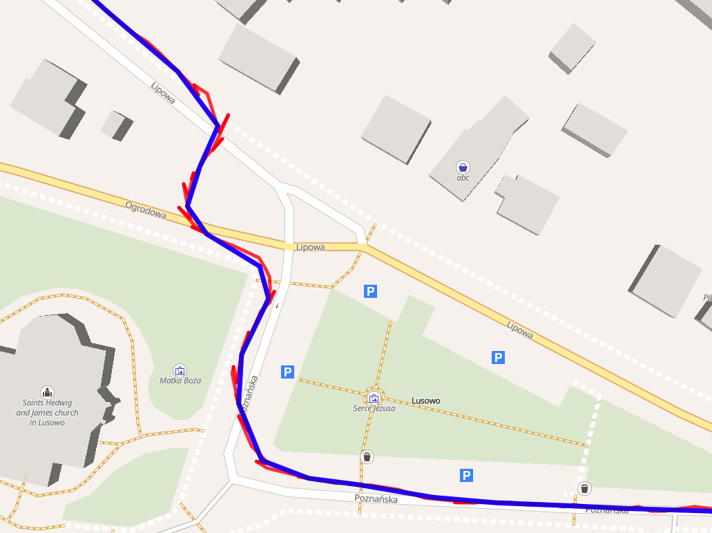

# GPX Fixer

A lightweight browser tool to reduce GPX file size and smooth route tracks.

<a href="https://jchwaz-0ne.github.io/gpx_fixer/" target="_blank" rel="noopener noreferrer">jchwaz-0ne.github.io/gpx_fixer</a>

## What it does

- **Compresses GPX files:** Merges nearby points to make files smaller.
- **Two modes:** Combine points by count (e.g., every 5 points) or time interval (e.g., every 5 seconds).
- **Keeps telemetry:** Smoothly averages elevation, heart rate, cadence, power, and temperature.

## Example

- 🔴 **Red line:** Original GPX track
- 🔵 **Blue line:** Cleaned GPX track